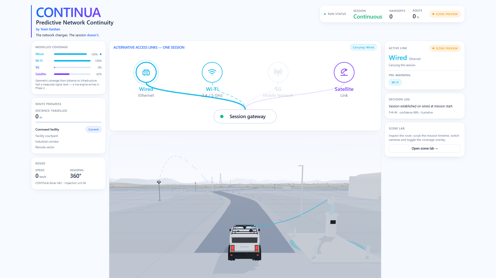
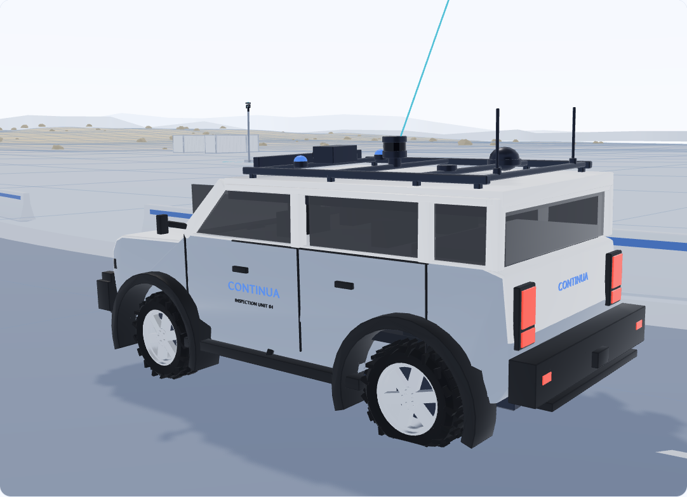

# CONTINUA

**Predictive Network Continuity** — by Team Kanban
*The network changes. The session doesn't.*

An interactive 3D scene following an unarmed emergency-response / industrial
inspection rover as it drives from a wired docking facility, through Wi-Fi and
cellular coverage, into a remote satellite-served sector — and shows how the
session survives every handoff.



## Run it

```bash
npm install
npm run build
npm run start
```

- Dashboard — <http://localhost:3000>
- Scene lab — <http://localhost:3000/scene-lab>

`npm run dev` for hot reload. Node 20.11+ required.

## What this is

**Phase 1 of 3: the vehicle, the world and the visual foundation.**

Everything you see is generated from source in this repository — the rover, the
buildings, the masts, the terrain, the route. There are no purchased models, no
downloaded HDRIs, no webfonts, and nothing is fetched at runtime.

The network behaviour shown is a **deterministic geometric preview**, derived
from distance to infrastructure. It is not a measurement, every panel says so,
and Phase 2 replaces it with a real engine behind an interface that already
exists.



## Commands

| Command | What it does |
| --- | --- |
| `npm run dev` | Development server |
| `npm run build` / `npm run start` | Production build and serve |
| `npm run lint` | ESLint across app and packages, zero warnings |
| `npm run typecheck` | TypeScript, no emit |
| `npm run test:smoke` | Playwright, 11 tests, 1920/1440/1280 |
| `npm run test:perf` | Real-GPU frame rate (needs local Chrome) |
| `npm run blender:all` | Regenerate every 3D asset from script |
| `npm run checkpoint:status` | Checkpoint supervisor status |

## Layout

```
apps/web/            Next.js 16 frontend
packages/scene/      Reusable 3D scene: clock, route, terrain, rig, cameras
packages/contracts/  Shared types — the Phase 2 seam
assets/blender/      .blend sources
assets/previews/     Studio renders and browser evidence
scripts/blender/     Reproducible generation and export
docs/                Design spec, architecture, asset manifest, progress, handoff
tests/               Playwright smoke and evidence capture
```

## Documentation

| Document | Contents |
| --- | --- |
| [`CLAUDE.md`](CLAUDE.md) | Project rules and the checkpoint policy used by all phases |
| [`docs/DESIGN_SPEC.md`](docs/DESIGN_SPEC.md) | Reference analysis and design tokens |
| [`docs/ARCHITECTURE.md`](docs/ARCHITECTURE.md) | Scene and application boundaries, determinism |
| [`docs/ASSET_MANIFEST.md`](docs/ASSET_MANIFEST.md) | Assets, licences, the orientation contract |
| [`docs/PROGRESS.md`](docs/PROGRESS.md) | Measured results, defects fixed, limitations |
| [`docs/PHASE_1_HANDOFF.md`](docs/PHASE_1_HANDOFF.md) | Everything Phase 2 needs |

## Measured

- Rover: 38,120 triangles, 1.39 MB `.glb`; LOD 16,784 / 549 KB
- Full scene: 131 draw calls, 2.28 MB of runtime assets
- **233.8 fps** at 1920×1080, `high` quality, on Intel integrated graphics
  (ANGLE / D3D11), uncapped rAF — see `docs/PROGRESS.md` for method

## Phases

| Phase | Scope | State |
| --- | --- | --- |
| 1 | Vehicle, world, route animation, scene components, design system, `/scene-lab` | **complete** |
| 2 | Predictive network engine, real link and handoff logic, live scene-state feed | not started |
| 3 | Competition video capture and edit | not started |
