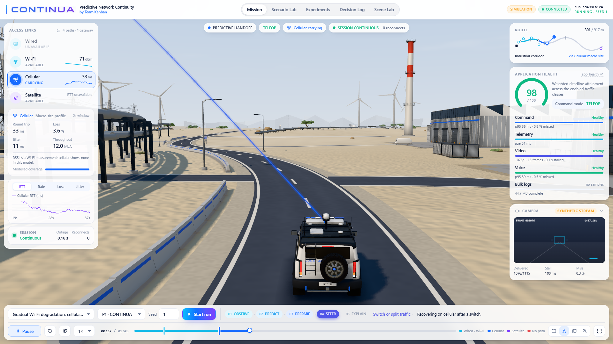
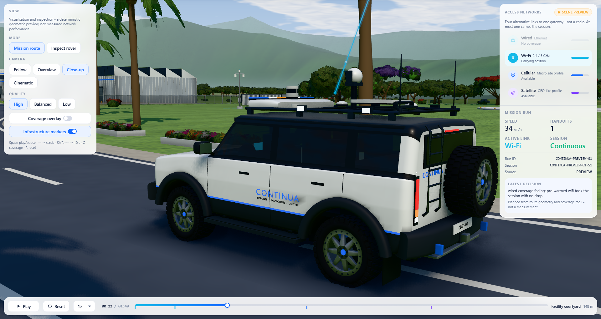
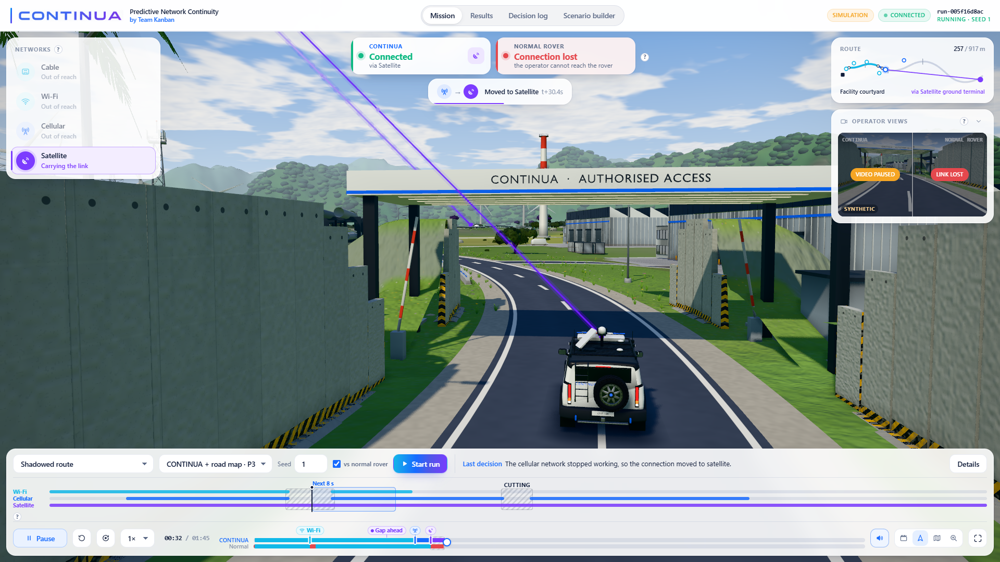
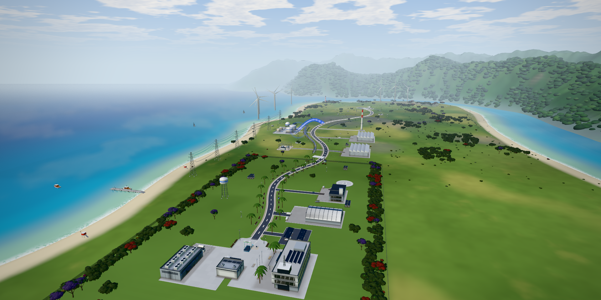
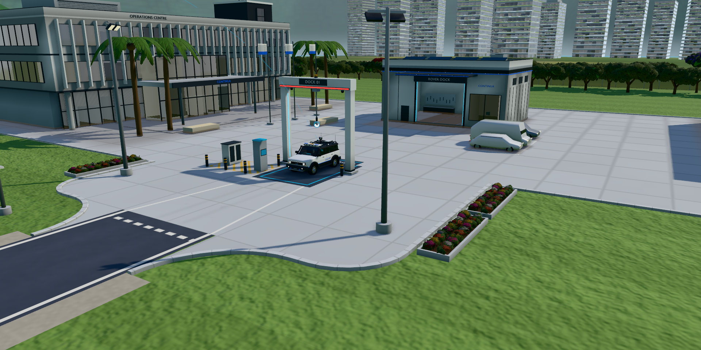
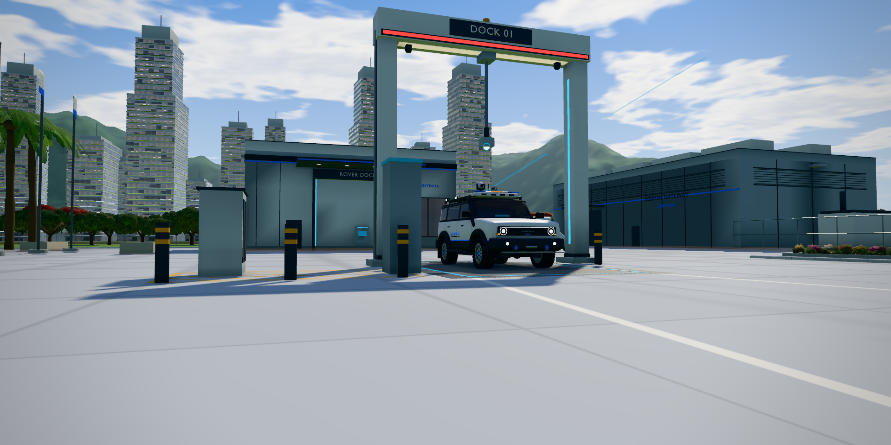
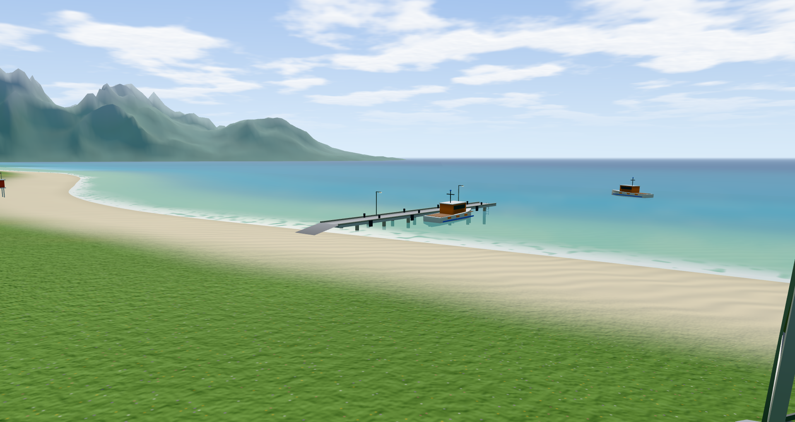
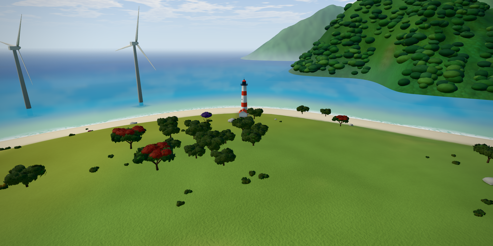
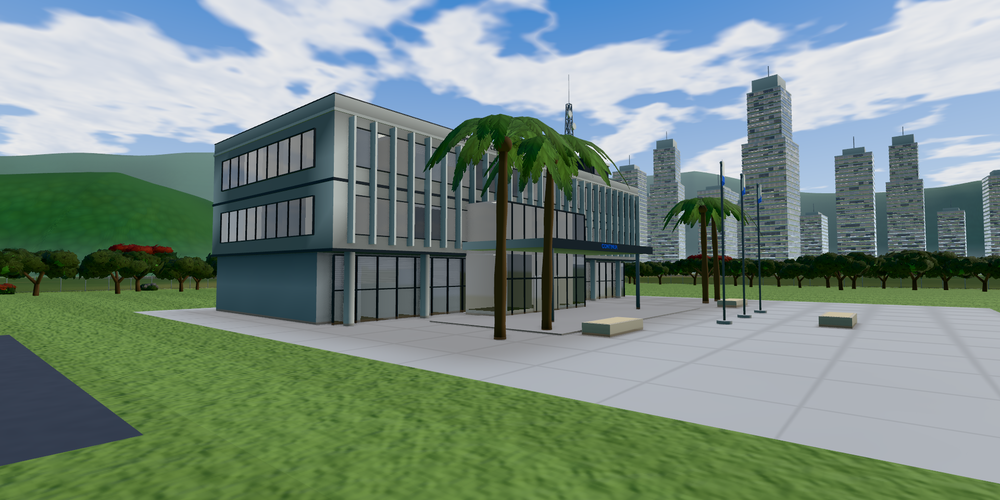
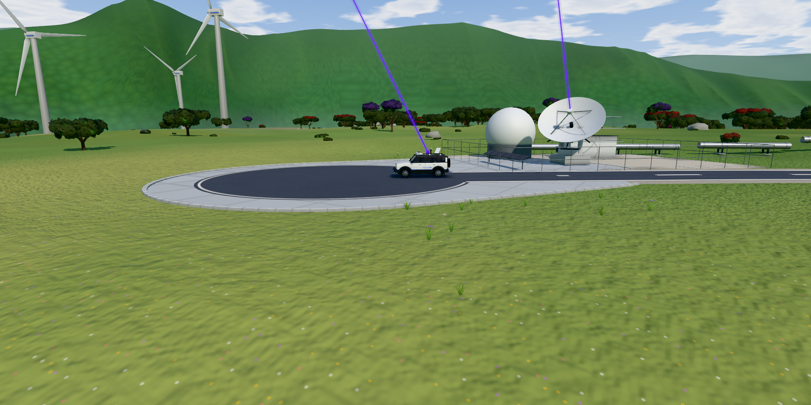

# CONTINUA

**Predictive Network Continuity** - by Team Kanban
*The network changes. The session doesn't.*

An interactive 3D scene following an unarmed emergency-response / industrial
inspection rover as it drives across a green coastal island - from a wired
docking facility, through Wi-Fi and cellular coverage, out to a
satellite-served headland - and shows how the session survives every handoff.



**Live: <https://continua.kanbanstudios.ae>** - the full interface, playing runs
the engine recorded. Every scenario and every policy is there; see
[The public deployment](#the-public-deployment) for what it can and cannot do.

## Run it

```bash
npm install
npm run engine              # engine on 127.0.0.1:8000 - leave this running
npm run build && npm start  # app on localhost:3000
```

| URL | Section |
| --- | --- |
| <http://localhost:3000> | **Mission** - opens on what this is and one way in, **Watch the two rovers**: the shadowed route, CONTINUA and the normal rover side by side, then any scenario and strategy - in plain words, said aloud, with every measurement behind **Details** |
| <http://localhost:3000/?story> | The story - the link to send someone: the same run in the app as a narrated minute with chapter captions |
| <http://localhost:3000/experiments> | **Results** - every paired comparison, twenty drives a strategy at a glance, then the full tables and the execution-capability report |
| <http://localhost:3000/decision-log> | **Decision log** - every controller action, with its observations, reason and the run's recorded outcome |
| <http://localhost:3000/scenario-lab> | **Scenario builder** - inject failures and congestion, change speed and workload |
| <http://localhost:3000/challenge> | **The brief** - the EDGE challenge's five success criteria, each mapped to its evidence, the existing mechanisms it is measured against, and what this is not |
| <http://localhost:3000/credits> | **Credits** - Team Kanban, the stack, and where every figure comes from |
| <http://localhost:3000/capture?run=…> | Fixed 16:9 capture frame |
| <http://localhost:3000/scene-lab> | The 3D workbench: cameras, quality tiers, the rover up close |

Node 20.11+ and Python 3.11+ required. Engine dependencies:
`pip install -r services/engine/requirements.txt`. If port 8000 is taken,
start the engine on another port and set `NEXT_PUBLIC_ENGINE_URL` in
`apps/web/.env.local` before building.

## What this is

**Phases 1–2 of 3: the vehicle and world, and a working application-aware
connectivity prototype.**

A Python engine simulates four access paths - finite queues, capacity, delay,
jitter, correlated burst loss, activation delay, competing demand and per-byte
cost - and carries five real traffic classes across them. A controller observes,
predicts, prepares a backup, steers, and explains itself. The 3D scene
visualises the experiment; it is not the networking engine.

**Everything here is a deterministic software model.** It is not a live
mobile-network test. The execution mode is stamped on every event, on the
dashboard and in the capture frame. Emulation and MPTCP are **not verified on
this machine** - the reasons were probed, not assumed, and are recorded in
`data/emulation_capability.json` (the September probe is kept as
`data/emulation_capability_2026-09-08.json`; in October WSL had no
distribution at all, and nothing was executed).



### The Mission page

The page opens on a still island, what the stored twenty-drive comparison
found on the road it is about to drive, and one button, **Watch the two
rovers**, which starts the run that shows what CONTINUA is for: two
identical rovers on the shadowed route, same seed, both drawn - CONTINUA in
white from DOCK 01, and in grey from DOCK 02 the normal rover, which only
switches network once the one it is on has failed. Coming off the cable the
normal rover loses its link for 0.9 s; CONTINUA does not. A cutting ahead
blocks Wi-Fi and cellular together; CONTINUA's road map sees it 79 m out and
starts satellite in time, and the normal rover loses its link for 4.5 s: it
is drawn braking to a stand with its hazard lamps flashing, the camera
looks back at it standing there while CONTINUA drives on, and it pulls away
some 45 m behind - and then stays on satellite, the slow and costly link, for
the rest of the road, because it only ever moves once its network has failed.
(The engine moves both rovers along the same path whatever their links do,
which keeps the comparison paired; the stop is drawn from the receiver's
outage, not simulated - [assumptions](docs/ASSUMPTIONS.md).)

While a run plays the screen holds four things, and nothing else:

* **Can each operator reach their rover** - one card, the two rovers either
  side of a "vs", red the moment one is cut off and counting how long.
* **What just happened**, said once under it: the road map's warning ("Dead
  zone 79 m ahead") or a change of network and why ("Cellular stopped
  working · Satellite was already up"). At every change of network the
  camera **flies to where the new link comes from** - out to the access point
  or the cell mast, or high above the road for satellite - holds there with
  the beam arcing to the rover, then rides the beam back to it
  (`packages/scene/src/components/Cameras.tsx`; the flight is a pure function
  of the clock, so a capture replays it frame for frame, and a toggle in the
  bar turns it off). A voice keeps a running commentary built from the two
  runs' events - why each switch happened, what the road map saw, each rover
  losing its link and what it was missing, how long the normal rover stood,
  how the run ended (`apps/web/src/components/mission/commentary.ts`); the
  lines are recorded on this machine with a voice that ships with Windows
  ([AI use](docs/AI_USE.md)), and a speaker button turns it off.
* **Head to head** - both operators' camera views, and four running totals
  read from each run's own events at the same moment of the road: time
  without a link, video frozen, steering commands late, data over satellite.
  The gap is set by the strategy alone, and it grows as the road goes on
  (`apps/web/src/components/mission/HeadToHead.tsx`).
* **One slim bar** - transport, both rovers' timelines, **Change the run**
  (road, strategy, comparison, seed, speed) and **Details**. It steps aside
  while a run plays untouched; any movement brings it back.

**Coverage** in the bar draws where the dock's cable, each Wi-Fi access point
and the cell mast reach - kept apart from the route and the active link.

The end card puts the same four totals side by side and, in the same card,
what acting early cost: more changes of network, and big uploads held back.
Every measurement stays one click away under **Details**.
`/?story` plays the same run in the app as a narrated minute with chapter
captions, ending on the stored comparison
(`apps/web/src/components/mission/story.tsx`). Nothing in it is scripted:
every number is read from the runs' own events.



### The world

A green coastal island: the operations campus and its lawns, the industrial
corridor, a wind farm standing out to sea, forested ranges across the water,
and the ground station on a headland under a lighthouse, where the road ends
in a turning circle. Every run starts at the rover's dock: a charcoal bay
under a launch gantry whose status line is red while the rover is docked and
turns green as it pulls out, in a kerbed yard between the operations centre
and the rover's garage, with the campus road leaving it through a bell-mouth.
Office glazing mirrors the sky with lit rooms behind it. Everything in it is
scenery - nothing in the network model knows about the sea or the mountains -
with one exception that runs the other way: where a scenario shadows the
links (the five `shadow-*` scenarios), the world stands what the shadow
stands for, a cutting - grassed banks held back by precast retaining walls,
open to the sky - built from the scenario's own `from_m` / `to_m`, and only in
those scenarios.



| | |
| --- | --- |
|  |  |
|  |  |
|  |  |

`node scripts/scene-shots.mjs --set world --height 1020 --out assets/previews/browser`
renders these from fixed points.

## Commands

| Command | What it does |
| --- | --- |
| `npm run engine` | Start the Python engine |
| `npm run dev` / `npm run build` / `npm start` | Frontend |
| `npm run lint` · `npm run typecheck` | Static checks, both clean |
| `npm run test:engine` | engine tests, including the Phase 4 regression guard |
| `npm run test:phase2` | 11 browser tests (engine must be running; `CONTINUA_ENGINE` overrides its URL) |
| `npm run test:smoke` | Phase 1 scene tests, 3 viewports |
| `npm run experiment:smoke` | 2 trials × every scenario |
| `npm run experiment` | 20 paired trials × 6 core scenarios × every policy |
| `python scripts/phase4_tune.py` | Phase 4 hysteresis grid on the tune block, selection rule declared in the script |
| `python scripts/phase4_experiment.py` | The Phase 4 comparison on `test2`, run once; refuses to run twice |
| `python scripts/phase4_results.py` | Renders `docs/PHASE_4_RESULTS.md` from the recorded experiments |
| `python scripts/phase5_headroom.py` | Phase 5: how much any earlier switch could have saved, on the tune block |
| `python scripts/build_radio_map.py` | Phase 5: the radio maps, from survey drives on the train block |
| `python scripts/phase5_experiment.py` | The Phase 5 comparison on `test4`, run once; refuses to run twice |
| `python scripts/phase5_results.py` | Renders `docs/PHASE_5_RESULTS.md` from the recorded experiments |
| `npm run train:predictor` | Retrain the learned predictor |
| `npm run emulation:status` | Honest capability report for this host |
| `npm run blender:all` | Regenerate every 3D asset |

### The public deployment

The engine is Python and does not run in a browser, so
<https://continua.kanbanstudios.ae> has no backend at all. Instead the whole
scenario-by-policy matrix is executed by the real engine ahead of time and
exported, and the site replays it: selecting a scenario and a policy plays the
run the engine produced for that pair, badged `REPLAY - SIMULATION` with the
source run id and its recording time, exactly as a replay is badged locally.

Re-implementing the simulator in TypeScript was the alternative. It would have
produced a second set of numbers disagreeing with the ones in every document
here, so it was not done. The one thing the deployment therefore cannot do is
*compose* a run nobody has executed: the Scenario Lab's fault-injection and
workload overrides are hidden there, and the page says so.

| Command | What it does |
| --- | --- |
| `python scripts/build_demo_data.py` | Run the matrix through the engine and export it to `apps/web/public/demo/` (~3 min, 40 runs, 43 MB, about 4 MB on the wire) |
| `node scripts/build-brand-logo.mjs` | Un-matte `logo.png` to a transparent wordmark |
| `npm run deploy` | Static export into `apps/web/out/` in public-preview mode, checked, then published to Cloudflare (`-- --dry` stops before publishing) |

The site plays no film. The 30-second intro and the two-minute narrated
walkthrough made in October are files in `deliverables/`; their storyboard,
claim ledger and voice script are in `brag-output-2026-10-06-230856/brag-plan.md`,
and the frame-exact capture, voice, edit and stills scripts in
`brag-output-2026-10-06-230856/work/`. Both were recorded while the Mission page
still offered driving by hand (W A S D), which has since been taken out. The
earlier one-minute film's sources stay in `brag-output/`. `edge/worker.js` still
answers byte ranges for `/video/*`, which Safari needs to play a video at all;
everything else is plain static assets.

Run files are columnar: one array per field path rather than one object per
event, which is the same data at a third of the size. `decodeRun` in
`apps/web/src/lib/staticDemo.ts` reverses it.

### The demo video

Each step reads the one before it; `video/timeline.json` is the edit decision
list and `docs/VIDEO_CLAIMS.md` is the gate.

| Command | What it does |
| --- | --- |
| `npm run video:cards` | Extract the caption-card figures from recorded runs and experiments |
| `npm run video:renders` | Blender opening and closing shots, 1920×1080 |
| `npm run video:capture:test` | 5 s probe capture - run this before the full one |
| `npm run video:capture` | Deterministic frame capture of every application shot and card (~6 min) |
| `npm run video:narration` | Local TTS, measured and fitted to the timeline; fails if a line does not fit |
| `npm run video:claims` | Banned phrases, claim resolution, timeline integrity |
| `npm run video:build` | Composite, encode, poster, contact sheet, manifest |
| `npm run video:qa` | Inspect the finished MP4 and write `docs/VIDEO_QA.md` |
| `npm run voice:lines` | List every line the page's voice can say: the drive's by running its commentary over every recorded run, the story's from a run of it (app and engine running) |
| `npm run voice:build` | Record those lines locally with a Windows voice, into `apps/web/public/voice/` |

The shipped demo was re-voiced on 2026-10-07 with the films' narrator, its picture
and subtitles unchanged (`brag-output-2026-10-06-230856/work/revoice_demo.py`;
`docs/VIDEO_QA.md`). `npm run video:narration` still makes the original
Windows-voiced track.

## Layout

```
apps/web/            Next.js 16 frontend - Mission (story and drive), Results, Decision log, Scenario builder, The brief, Credits
services/engine/     Python engine - simulator, controller, predictors, API, experiments
packages/scene/      Reusable 3D scene, plus the engine-driven scene source
packages/contracts/  Shared types (TypeScript + Python) and world.json
scripts/emulation/   Linux namespace / netem topology scripts
assets/              .blend sources, reference imagery, renders, browser evidence
data/                Experiment results and capability report (run logs are git-ignored)
docs/                Ten documents - see below
tests/               Engine (pytest) and browser (Playwright) suites
```

## Documentation

| Document | Contents |
| --- | --- |
| [`CLAUDE.md`](CLAUDE.md) | Project rules and the checkpoint policy used by all phases |
| [`docs/DESIGN_SPEC.md`](docs/DESIGN_SPEC.md) | Reference analysis and design tokens |
| [`docs/ARCHITECTURE.md`](docs/ARCHITECTURE.md) | Scene and application boundaries, determinism |
| [`docs/ASSET_MANIFEST.md`](docs/ASSET_MANIFEST.md) | Assets, licences, the orientation contract |
| [`docs/PROGRESS.md`](docs/PROGRESS.md) | Measured results, defects fixed, limitations |
| [`docs/PHASE_1_HANDOFF.md`](docs/PHASE_1_HANDOFF.md) | Everything Phase 2 needed |
| [`docs/ASSUMPTIONS.md`](docs/ASSUMPTIONS.md) | Everything modelled rather than measured |
| [`docs/METRICS.md`](docs/METRICS.md) | Every metric, unit and measurement window |
| [`docs/EXPERIMENT_METHOD.md`](docs/EXPERIMENT_METHOD.md) | Pairing, seed blocks, and how not to fool yourself |
| [`docs/PHASE_4_RESULTS.md`](docs/PHASE_4_RESULTS.md) | Phase 4: steering and mode handover, every scenario, with the losses |
| [`docs/PHASE_5_RESULTS.md`](docs/PHASE_5_RESULTS.md) | Phase 5: route-aware preparation (P3), the ceiling on trend prediction, the shadowed route |
| [`docs/MODEL_CARD.md`](docs/MODEL_CARD.md) | The learned predictor, including its calibration failure |
| [`docs/SECURITY.md`](docs/SECURITY.md) | Threat model and known weaknesses |
| [`docs/AI_USE.md`](docs/AI_USE.md) | Where ML is used, and why no LLM is in the routing loop |
| [`docs/PHASE_2_HANDOFF.md`](docs/PHASE_2_HANDOFF.md) | Everything Phase 3 needs |
| [`docs/VIDEO_CLAIMS.md`](docs/VIDEO_CLAIMS.md) | Every claim in the video, with its run ID, evidence mode and status |
| [`docs/VIDEO_QA.md`](docs/VIDEO_QA.md) | What was checked in the finished MP4, and what was not |
| [`docs/SUBMISSION_CHECKLIST.md`](docs/SUBMISSION_CHECKLIST.md) | Deliverables, reproduction steps, and what was deliberately not done |

## Measured

**720 paired experiment runs** - 20 trials × 6 policies × 6 core scenarios,
0 failures. On `wifi-degradation`, CONTINUA matches always-on redundancy on
continuity (0 reconnects, 0.16 s interruption) while using **4.8 MB of satellite
instead of 61.2 MB (−92 %)**, **1.25 cost units instead of 4.31 (−71 %)** and
**37 % less video stall**. Under cellular congestion it cuts control deadline
misses from 49 % to **31 %**.

**And an honest negative result:** a forecast of a link's own trend does not
pay for itself. The `P1 − P1-noPred` ablation is a wash at both predictor
qualities tested - the value is in *preparation* and *application-awareness*.
Full numbers, including where CONTINUA loses, are in `docs/PROGRESS.md`.

**Where prediction does pay (Phase 5).** Measured first: with a warm backup
always ready, the steps an earlier switch could improve hold under 0.4 % of
any class's losses, so no better trend forecast can help. What a forecast can
still buy is a path prepared *before* it is needed, when the backup fails at
the same place as the carrying link - and only a map of the route can see
that. **P3** looks the next 8 s of its route up in a radio map built from
earlier survey drives and, where the carrying path and its warm backup are
both lost ahead, brings up a third in time. On a shadowed route where P1 loses
the session for 4.5 s at a cutting in **every one of 20 trials** (reconnect,
safe stop), **P3 never does**, at the same cost as P1 or less and about
0.3 MB more satellite traffic; against always-on redundancy, the same
continuity for a third of the cost or less. It is **not cheaper than
B2-defer**, and an out-of-date map costs 0.40 units for nothing. Everywhere
else P3 is P1, trial for trial. `docs/PHASE_5_RESULTS.md`.

Rendering (kept separate from network metrics): 159 fps uncapped at
1920×1080 during a run beside the normal rover, frame time p95 8.8 ms,
high tier with ambient occlusion, the grade and the ranges' forest on, on an
RTX 4070 Laptop GPU
(`node scripts/perf-probe.mjs`); one shared canvas for every scene page, so
switching pages builds nothing; 2.66 MB of Draco-compressed models.
On a slower GPU the scene steps its own quality tier down, and a software
rasteriser starts on the low tier.

## Phases

| Phase | Scope | State |
| --- | --- | --- |
| 1 | Vehicle, world, route animation, scene components, design system, `/scene-lab` | **complete** |
| 2 | Network engine, controller, dashboard, experiments | **complete** |
| 3 | Demo video: claim ledger, deterministic capture, narration, edit | **complete** |
| 4 | Per-class steering, control mode handover, B2-defer baseline, test2 comparison | **complete** (see `docs/PHASE_4_RESULTS.md`) |
| 5 | Route-aware preparation: radio map from survey drives, P3, the shadowed route, test4 comparison | **complete** (see `docs/PHASE_5_RESULTS.md`) |
| 7 | Visual overhaul: Mk2 rover, 48-prop world kit, procedural ground and daylight, immersive interface | **complete** (see `docs/PROGRESS.md`) |
| 8 | A green coastal island (sea, beaches, mountains, clouds, flowering trees), one shared canvas across pages, a live rover camera | **complete** (see `docs/PROGRESS.md`) |
| 9 | Smooth motion; lush island ranges, leaf-card trees and woods; the satellite link in the sky; CONTINUA run beside a reactive baseline | **complete** (see `docs/PROGRESS.md`) |
